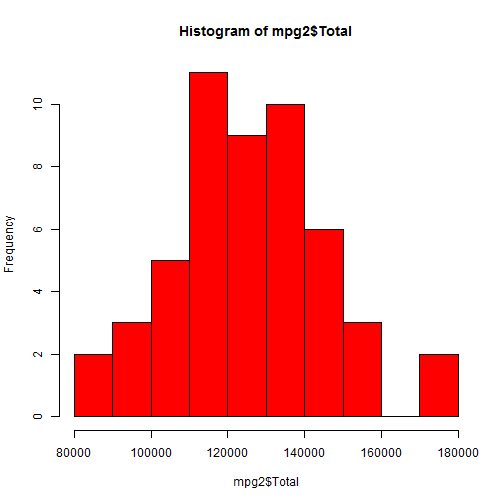
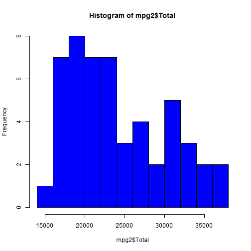
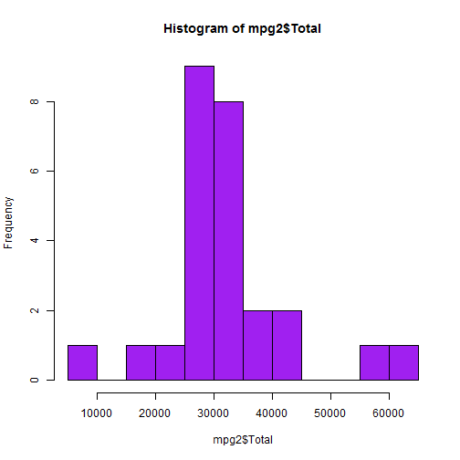
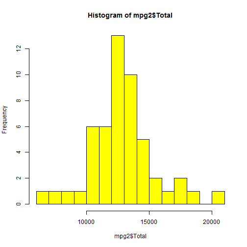

R Studio Presentation Project
========================================================
transition:rotate
author: Gonzalo Andres Moreno
date: Tue May 19 21:32:55 2015

First Slide

========================================================

Goal

- To show an example of shiny and R Studio Presenter
- To graph histogram of sales of each city (BOGOTA, VILLAVICENCIO, BUCARAMANGA AND YOPAL)


Slide With Code
========================================================


```r
setwd("D:/personal/data science/develop data products/ejemplos/ejemplo2")
mpg<-read.csv("salesfile.csv", header=TRUE)
summary(mpg)
```

```
       X               yearmon          nombre.Agencia     Total       
 Min.   :  1.0   2011-07-01: 20   BOGOTA       : 51    Min.   : -1705  
 1st Qu.:152.2   2011-01-01: 19   DORADA       : 51    1st Qu.:  3314  
 Median :303.5   2011-05-01: 19   FLORENCIA    : 51    Median :  7612  
 Mean   :303.5   2011-06-01: 19   IBAGUE       : 51    Mean   : 19201  
 3rd Qu.:454.8   2011-02-01: 18   NEIVA        : 51    3rd Qu.: 15592  
 Max.   :606.0   2011-03-01: 18   VILLAVICENCIO: 51    Max.   :175453  
                 (Other)   :493   (Other)      :300                    
```

Histogram of Bogota's Sales
========================================================


```r
mpg2<-subset(mpg,nombre.Agencia== "BOGOTA" )
hist(mpg2$Total, breaks=10, col="red")
```

 


Histogram of Villavicencio's Sales
========================================================


```r
mpg2<-subset(mpg,nombre.Agencia== "VILLAVICENCIO" )
hist(mpg2$Total, breaks=10, col="blue")
```

 
Histogram of BUCARAMANGA's Sales
========================================================


```r
mpg2<-subset(mpg,nombre.Agencia== "BUCARAMANGA" )
hist(mpg2$Total, breaks=10, col="purple")
```

 
Histogram of YOPAL's Sales
========================================================


```r
mpg2<-subset(mpg,nombre.Agencia== "YOPAL" )
hist(mpg2$Total, breaks=10, col="yellow")
```

 


